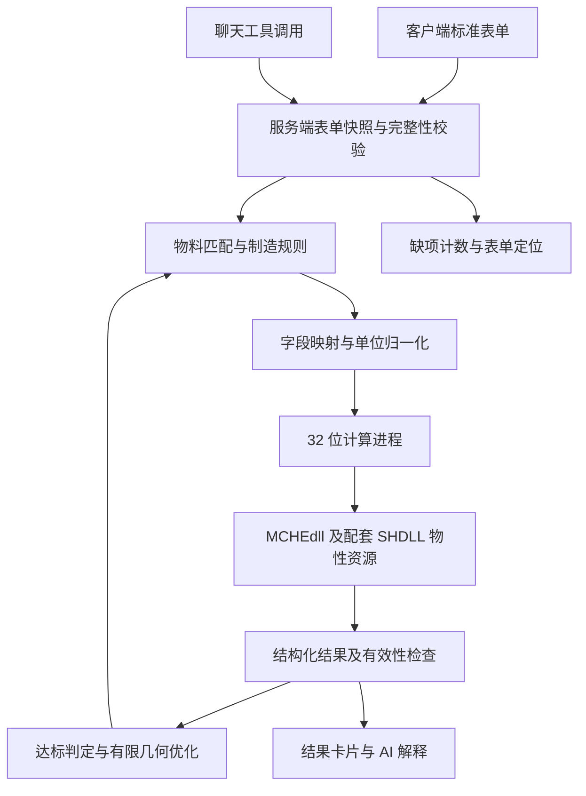

# 微通道单排计算智能体设计稿

日期：2026-09-08。状态：待评审；本文是需求与接入设计，业务功能尚未实现。
关联任务：`.tll/tasks/mche-single-row/task.md`。

## 1. 目标与首版边界

在现有 DSH Lite 应用中建立“标准表单 → 确定性校验 → 几何组合 → 原生计算 → 结果解释与有限优化”的闭环。
用户在客户端标准表单填写工况与目标；广元交付的正式输入表是定义字段的唯一业务依据。
聊天负责说明缺项、解释计算结果及触发受限工具；聊天文本、截图、模型推测不能成为计算输入。

- 首版只计算单排；前端、服务端、优化器、原生适配层都拒绝双排请求。
- 冷凝器和蒸发器分别验证参数模式与黄金算例；未验证的模式不开放计算。
- 主目标为换热量；特殊目标为出风温度，不能与“冷媒出口温度边界条件”混淆。
- 工况保持不变，只允许在经确认的物料和制造范围内调整几何参数。
- 双排增排优化与空气/冷媒逆流布置列入后续版本，首版不自动切换双排。
- 不以任意补齐到“30 个字段”为验收标准：字段数与条件必填关系必须从正式表得到。

## 2. 当前仓库与运行库证据

### 应用接入点

当前提交为 `596ab22`。本次开始时 `.tll/`、`AGENTS.md`、`runtime/` 已是未跟踪文件。
`README.md` 与 `profiles/lite/package.json` 表明应用已有聊天、模型配置、提示词和工作区插件。
`packages/dsh-lite-web-app/src/index.js:14` 创建聊天运行时并注册 HTTP 页面/API。
`packages/dsh-lite-web-app/src/runtime.js` 将 `prompt` 交给 `agent.followup()`，收集完成事件并返回回答。
`packages/dsh-lite-web-app/src/http.js` 当前接收文本聊天请求，尚无工程表单、材料目录或计算 API。
本会话无可用 ace-tool；CodeGraph 返回当前项目未初始化，以上结论来自实际文件阅读。

### 原生职责与位数

直接解析本仓库 PE 文件得到：

| 文件 | 架构 | 已核实导出与职责依据 |
| --- | --- | --- |
| `runtime/MCHEdll.dll` | PE32 / x86 | `CalcCondenser`、`CalcEvaporator`、`BatchPassConCal`；外部源码实际调用前两者计算换热器 |
| `runtime/SHDLL/SHProp.dll` | PE32 / x86 | 16 个物性相关导出，包括 `hrpt`、`trph`、`MoleMass`、`SPGetAllPH` |
| `runtime/SHDLL/REFPROP.DLL` | PE32 / x86 | REFPROP 物性库 |

整机计算应接 `MCHEdll.dll`，配套使用 `SHDLL/SHProp.dll` 和 REFPROP 运行资源。
只有确需独立物性查询、且获得相应函数签名时，才另外封装 SHProp 工具。
导出名称不能替代参数类型、调用约定、单位、初始化顺序与线程安全契约。

三个文件 SHA-256：

```text
MCHEdll.dll         13de5fc0f6e76e6585ff755fbc4bebea1e5e00f959b0c3dc70ae9c90a753a5f9
SHDLL/SHProp.dll    2db0c210a88df01187a9dc13da63ddc61d243c9028247a1aef75611473853e6c
SHDLL/REFPROP.DLL   ff17e8e9183ab25a10ee3d59954bcb207face3b62d549f915160f1fe8c5ba652
```

本次对比确认这三个文件与 `E:\projects_related_files\微通道\MCHE2026\MCHE2026\HXsim` 同名文件一致。
未进行整个 runtime 目录的一致性校验，因此不宣称全部资源匹配。
项目 `.venv/Scripts/python.exe` 是 64 位；外部已有的 x86 Python 可用于接入验证：
`E:\projects_related_files\微通道\.python-x86\cpython-3.12.12-windows-x86-none\python.exe`。
本次用该解释器和 `os.add_dll_directory()` 成功加载本仓库三个 DLL，并取得计算及物性函数入口。
这是加载验证，没有执行任何换热计算，也没有验证当前项目中的 DLL 内部动态加载链。
该外部解释器旁已有 SHDLL junction，正式部署必须显式验证其目标，避免悄悄加载其他目录的库。

### 软件字段映射的已有技术依据

外部源码目录：`E:\projects_related_files\微通道\解释文件(2)`。
它可辅助技术映射，不能代替广元的正式输入表，也不能直接视为已确认的客户字段契约。

| 业务概念 | 源码中的软件字段/符号 | 候选原生位置 | 当前确认程度 |
| --- | --- | --- | --- |
| 排数 | General / Bank Num / `IN_BANKNUM` | `dGeneral[1]` | 枚举位置已核实，首版值限定 1 |
| 冷凝/蒸发场景 | `IN_TYPE`；`threadrun.cpp:202` 的分支 | `dGeneral[2]` | 源码 0 走蒸发，其他值走冷凝；适配层应只接受明确白名单值 |
| 扁管宽度 | Tube / `IN_TUBE_W` | `dTubeGemSI[4]` | 技术位置已核实；客户列名待正式表 |
| 翅片宽度 | Fin / Fin Depth / `IN_FIN_D` | `dFinGemSI[4]` | 必须确认业务“宽度”与软件“Depth”指同一尺寸方向 |
| FPI | Fin / FPI / `IN_FIN_FPI` | `dFinGemSI[2]` | 系统优化变量，制造范围与离散档位尚需交付 |
| 翅片高度 | Fin / Fin Height / `IN_FIN_H` | `dFinGemSI[3]` | 基准取所选刀具/物料规格；微调 ±0.1 mm |
| 开窗角度 | Fin / Louver Angle / `IN_LOUVER_A` | `dFinGemSI[8]` | 数组位置已核实，角度单位换算需结合单位实现验证 |
| 翅片导热系数 | Cost / `IN_FIN_K` | 独立参数 `dFinK` | `threadrun.cpp:179` 从材料输入读取；不可用任意默认值代替 |
| 总换热量 | Total Heat Load / `VAR_Q` | `dResult[0]` | `threadrun.cpp:1324` 展示 `fabs(dResult[VAR_Q])` |
| 出风温度 | `VAR_AIRTOUT` | `dResult[21]` | `index.h` 输出枚举已核实；显示单位需完整验收 |

`dll.h:7` 与 `dll.h:14` 声明的蒸发/冷凝函数各有 42 个原生参数，其中包含数组与矩阵。
这不是“表单只需填写 42 项”：还涉及流程连接、集管、分配、关联式、残差、风机参数和输出缓冲区。
`threadrun.h:36` 起可见扁管、翅片等固定容量数组；`threadrun.cpp:250` 起逐组转为 SI 输入。
接入必须核实所有使用位置、矩阵尺寸和边界模式，不能靠零填充掩盖必需参数缺失。

`runtime/DataBase/Geometry.db` 为 110592 字节，本次以 SQLite 只读连接时报 `file is not a database`。
其文件头不是 SQLite 标准头。未确认它是加密格式、其他格式或异常文件；不直接改写、不据此生成物料数据。

## 3. 方案选择

| 方案 | 实现方式 | 权衡 |
| --- | --- | --- |
| 推荐：现有应用增加 MCHE 插件 | 复用 DSH 的会话、工具注册、HTTP 服务，业务逻辑独立模块，原生计算在 x86 子进程 | 改动集中，保留当前应用能力；需要给聊天页增加表单入口与工程状态展示 |
| 独立 MCHE 后端服务 | DSH 经 HTTP 调用独立工程服务，服务再调 x86 Worker | 适合多客户端共享；增加端口、部署、服务版本和任务状态同步成本 |

首版采用前者，职责划分如下：



新增模块预期放在 `packages/dsh-mche/`，计算桥接放在 `solver_worker/`。
具体包名和 API/共享类型在方案确认后定义；本设计稿不创建生效的共享契约。
现有聊天、模型和工作区存储继续复用，工程快照与运行结果由 MCHE 模块管理。
`package.json`、lockfile、profile bundle、共享接口和持久化目录都属于需确认的实施范围。

## 4. 输入来源、表单与校验

正式交付物至少包含以下信息：

1. 输入表：版本、字段编号、名称、分组、类型、单位、精度、枚举、必填条件、取值范围、默认值依据。
2. 映射清单：正式字段编号 → 软件页面 → 软件字段 → 枚举/数组下标 → 单位转换 → 条件依赖。
3. 非用户填写项清单：哪些由已选物料提供、哪些由系统计算、哪些为经研究院确认的求解配置。
4. 标准物料 Excel/TXT：唯一 ID、有效状态、材质、尺寸、适用场景、刀具基准、允许的 FPI/高度范围、单位与版本。
5. 冷凝/蒸发的完整参考算例及同版本软件结果，包含工况、材料、流程、求解配置与工程允许误差。

表单从同一份经确认的字段定义生成；前端与后端执行相同版本的业务规则。
必填集合按场景、边界模式及字段依赖动态展开，不能写死 30，也不能把所有模式的字段一起要求填写。
用户缺项、数值非法、物料缺数据、字段映射未确认分开显示；不能把后端配置问题算成用户“未填参数”。

- 缺项计数来自确定性校验结果；当实际缺少 17 个必填字段时显示“您还缺少 17 个未填参数”。
- 输入过程显示常驻摘要；点击计算或让 AI 触发计算时弹出缺项面板，点击条目定位对应表单控件。
- 空字符串、空白和缺失值不能转成 0；0 是否有效按字段语义处理，拒绝非有限数值。
- 缺字段、单位不明、模式不支持、映射未确认、无合法物料组合都阻止原生调用。
- 表单修订后旧结果标记为对应旧版本；新计算绑定不可变快照、字段定义版本与物料版本。
- 模型只可引用服务端保存的表单 ID/版本，不能通过工具参数塞入自由文本提取值或改写工况。
- 仅靠请求里的 `source: form` 标记不足以证明来源；调用端必须读取服务端已校验的实际快照。
- FPI 在表单展示为系统确定项；人工输入或模型伪造的 FPI 覆盖值不得被悄悄接受。

工况锁定需保留“风量”与“迎面风速”等输入模式语义：改变尺寸时不能同时把两者都当作独立恒定量。
由几何引起的派生量变化与主动改动用户工况必须区分，并在每个候选计算前校验。
目标换热量不直接覆盖求解结果；真实 `Total Heat Load` 经适配后才参与达标判定。

## 5. 几何与制造规则

| 规则 | 首版行为 | 尚需业务确认的部分 |
| --- | --- | --- |
| 扁管/翅片宽度匹配 | 统一单位及目录精度后匹配相同公称宽度，如 16 mm 配 16 mm | 与软件 Fin Depth 的尺寸方向对应关系 |
| 物料清洗 | 去除重复候选，排除无效与材质不符项，保留排除原因；不删除源表行 | 材质白名单、重复判定键、冲突记录处置规则 |
| 冷凝器开窗角 | 默认 27°；其他角度必须落在已批准配置范围内 | 用户未给出上下限，不能猜测 27°±某值 |
| 蒸发器开窗角 | 必须 ≥40°，且符合目录与刀具能力 | 材料目录实际可选范围 |
| FPI | 根据固定工况和计算反馈，在制造允许的离散档位中搜索 | 上下限、档位、刀具关联 |
| 翅片高度 | 相对当前所选标准物料/刀具的原始高度满足绝对偏差 ≤0.1 mm | 最小步长及尺寸精度 |
| 高度超范围 | 标为需定制刀具，不能作为现有可制造方案自动推荐 | 是否另开定制流程不在首版范围 |
| 排数 | 固定为 1，服务端及适配层同样拒绝 2 | 双排逆流在后续版本实现 |
| 单排气流方向 | 按需求允许左右方向，不作为性能优化变量 | 软件的枚举取值通过参考例映射确认 |

高度约束始终与刀具基准比较，不能每次加减 0.1 mm 后重置基准而累计越界。
切换扁管宽度后，必须重新筛选匹配翅片，并重新校验材料、角度、FPI 和刀具约束。
候选为空时报告约束冲突；不能虚构物料、复制其他宽度的翅片或跳过制造规则。

## 6. 目标、优化顺序与停止条件

主目标误差定义：`deviation = (Q_actual - Q_target) / Q_target`，要求目标换热量为有限正数。
以软件展示语义转换实际换热量，同时保留原始带符号输出供排查；输出异常不能直接取绝对值后隐藏。
按用户要求，低于目标属于不足；建议达标区间为 `[Q_target, Q_target × (1 + margin)]`。
`margin` 需业务从“10%–20%”明确为可执行的阈值或项目配置，未确认时可展示计算值，但不自动判定优化完成。

换热量超标的搜索顺序：

1. 调整用户所称“API（面积比）”。目前未找到经确认的对应字段、公式、单位与调整方向，不能视为 FPI 的别名。
2. 在刀具允许范围内调整翅片高度。
3. 若仍超标，搜索更小的合法扁管宽度，并重新配对翅片；32 →25.4 mm 仅为目录存在时的示例。

API 规则未明确前，暂停这一自动优化分支并解释原因，不擅自跳过优先级执行下一步。
换热量不足时，优先搜索增大 FPI、降低翅片高度的合法组合；首版单排范围内无解就返回“单排约束下未找到达标方案”。
后续版本才可考虑增排，并校验空气与冷媒逆流；当前优化器不能为追求换热量绕过单排限制。

出风温度目标使用计算得到的空气出口温度作为目标量，保留总换热量作为伴随结果。
先明确目标温度的允许偏差，再在固定入口工况下搜索几何；不得用冷媒出口温度字段替代，也不得只用未经验证的定比热公式推断换热量。
任何搜索规则都是候选生成顺序，实际优劣由计算验证，不能假定所有工况下性能单调变化。

建议初始技术预算为最多 24 个不同候选、每次计算超时 60 秒、总搜索 10 分钟；首次真实性能测量后复核。
记录已访问的几何组合，避免重复搜索；达到目标、候选耗尽、预算耗尽、取消或原生异常时终止。
预算耗尽与无可行方案分别报告；返回最佳已验证候选、偏差和未满足条件，不承诺全局最优。

## 7. 原生调用、状态与结果

Node/DSH 宿主通过固定参数的子进程协议启动 32 位 Worker，不经 shell 拼接执行。
解释器路径用显式运行配置指定；验证文件存在、进程位数、DLL 哈希、完整运行资源和动态加载位置。
配套 runtime 必须成套部署，不能只拷贝 SHProp，也不能混用外部旧 SHDLL。
原生调用先串行运行，避免 DLL 全局状态及共享 Log 文件相互污染；超时只清理本次启动的进程树。

调用前核对：场景白名单、排数、完整映射、数组长度、矩阵尺寸、字符串编码、单位、材料参数、固定工况哈希。
未使用的缓冲位置仅按已核实 ABI 初始化；不得以此补齐未确认的业务输入。
Worker stdout 仅输出协议结果，诊断写 stderr 或本次运行日志；原生异常不能破坏 Web 主进程。
结果需同时满足原生返回成功、错误缓冲符合接口约定、关键输出有限且满足场景有效性检查。

建议对外状态：草稿、缺少输入、规则不符、映射待确认、就绪、计算中、完成、失败、已取消。
“完成”表示本次计算结束；“达标”是独立判定，不能混同。
结果保存运行 ID、表单快照、归一化输入、工况哈希、材料与规则版本、DLL 哈希、原始输出、转换结果及耗时。
回放必须固定这些版本；AI 的自然语言结论引用运行 ID，不可生成未经计算的结果数字。
持久化先面向现有本机单用户模式，使用独立运行文件和原子写入；具体存储位置/格式在实施范围确认后落地。

## 8. 验收与实施顺序

1. S1 接入与规则设计：完成 DLL/现有架构核查、设计稿与缺口清单，并取得方案评审结论。
2. S2 正式资料与映射：逐项对齐正式表、软件字段、物料及求解配置；有未映射必需项时保持调用关闭。
3. S3 输入/制造校验：用测试覆盖缺项计数、条件必填、合法 0、单位、宽度、场景角度、FPI 来源、累计高度越界和双排拒绝。
4. S4 原生桥接：验证 64 位误配、依赖缺失、非法数组、超时、崩溃与错误输出；分别回放单排冷凝/蒸发参考例并对比软件结果。
5. S5 应用接入：表单与聊天同步显示后端校验结果；直接 HTTP/工具调用同样不能绕过校验；不配置模型也可完成表单校验。
6. S6 有限优化：验证工况不变、目标模式、制造范围、顺序、重配翅片、去重及预算；API/阈值未确认时对应能力保持关闭。
7. S7 整体验收：修复接入前已有失败项后运行现有回归、MCHE 测试、原生黄金例、浏览器操作及取消/修订场景。

关键反例必须观察“没有启动原生进程”，而不只断言界面按钮禁用。
同一正式算例至少比对换热量、空气出口温度、空气/冷媒压降；允许误差由研究院确认，不以“DLL 返回 true”代替验收。
浏览器验收实际填写部分表单，触发缺项弹窗并定位；补齐后计算，再改动输入确认旧结果不会冒充新结果。

本次验证记录：

| 检查 | 结果 | 限制 |
| --- | --- | --- |
| `tll context --json` | 初始无绑定任务、无候选；已新建 `mche-single-row` | 未将业务任务标记完成 |
| PE 结构/导出解析 | 三个 DLL 均为 x86，入口如第 2 节 | 静态证据 |
| SHA-256 对比 | 三个 DLL 与原始 HXsim 同名文件相同 | 未验证其他资源 |
| x86 `ctypes.CDLL` 加载 | 三个 DLL 加载成功，入口取得成功 | 没有执行换热函数 |
| `pnpm run typecheck` | 退出 0 | 现有配置主要覆盖 TypeScript CLI |
| `pnpm test` | 沙箱因 spawn EPERM 无法启动；获准重跑后 18 项中 17 通过、1 失败 | 现有 Cordis 集成测试切换模型后的新会话请求返回 502，根因未查明 |
| 正式表单/物料/映射验收 | 尚未执行 | 本会话未收到正式资料路径 |
| 真实微通道计算/浏览器验收 | 尚未执行 | 无已确认的本项目输入契约和参考算例 |

已有失败定位：`packages/dsh-model-config/test/runtime.test.js:91` 期望聊天响应 200，实际 502；
调用链到同文件 `verifyConversations:225`。发生于本次任何应用代码变更之前，不能归为 MCHE 新功能回归。

## 9. 进入实现前需确认

- 同意“现有 DSH 插件 + 独立 x86 Worker + 首版仅单排”的架构，以及随之必要的 bundle/依赖声明、共享契约和运行记录存储改动。
- 提供正式输入表、标准物料、映射清单及参考算例的位置；外部旧源码和示例仅作为技术参考。
- 业务规则交付需解决：API 的准确含义与调整规则、超标阈值、温度目标偏差、冷凝角度范围、FPI 档位与高度步长。

资料缺口允许逐项交付；受影响的计算或优化能力在对应确认和验证完成前保持关闭。
本次只新增设计与 TLL 任务记录，不修改应用、runtime、根配置、依赖或数据库；未提交或推送。
